# MR ROBOT — Walkthrough

**Author:** Tiago Dias  
**Room:** MR ROBOT (TryHackMe)  
**Goal:** Obtain the root flag and recover all key fragments.

---

## Summary
Recon → Web enumeration → Hidden content discovery (`robots.txt`) → Decode credentials → Foothold → Reverse shell → Stabilization → Local enumeration → Privilege escalation (GTFOBins / misconfigured binaries) → Root flag.

---

## How to read this walkthrough
- Screenshots are in `screenshots/`.  
- Outputs and credentials are redacted.  
- This is a learning walkthrough, not an exploit repository.

---

# Recon

**What I did:** Full port scan and service enumeration.

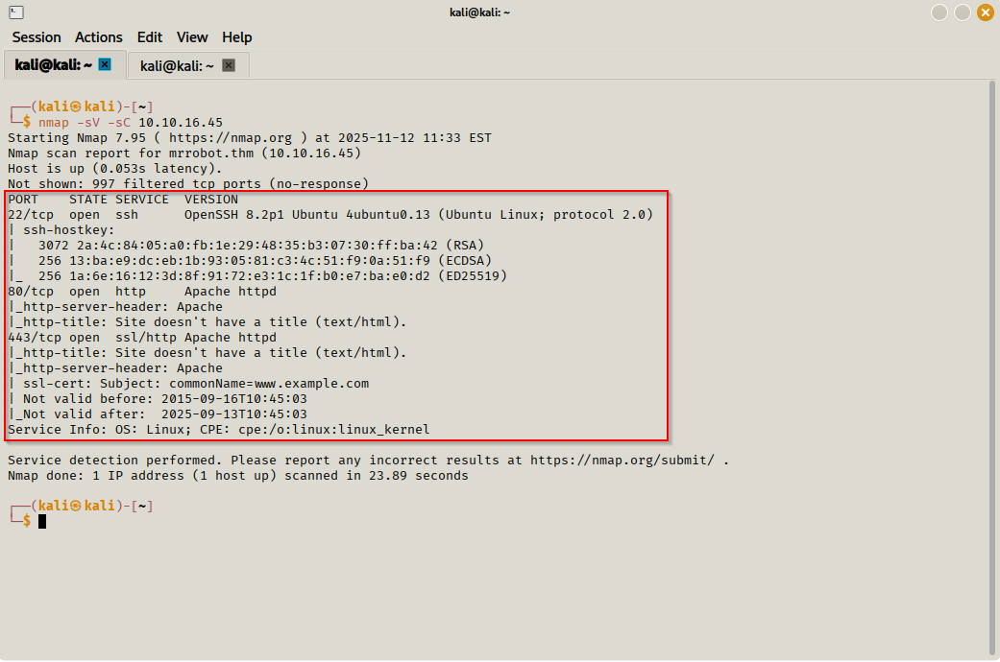  
*Figure 1 — Nmap showing exposed services for exploration.*

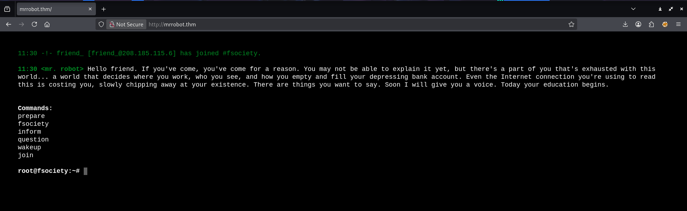  
*Figure 2 — Initial HTTP view of the MR Robot web application.*

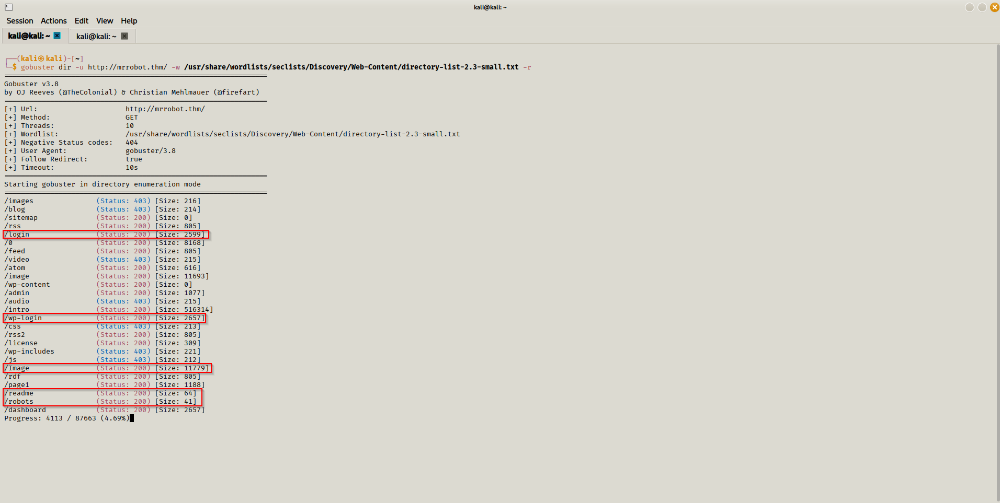  
*Figure 3 — Gobuster revealing hidden directories and files.*

**Notes:** The enumeration revealed hidden paths containing useful information.

---

# Web enumeration

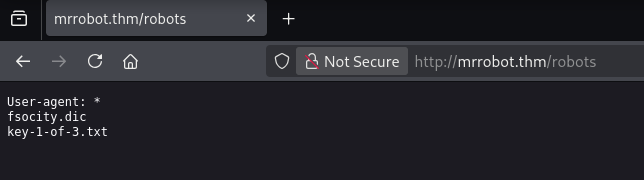  
*Figure 4 — robots.txt leaking hidden key paths.*

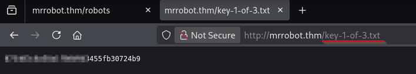  
*Figure 5 — First key fragment obtained.*

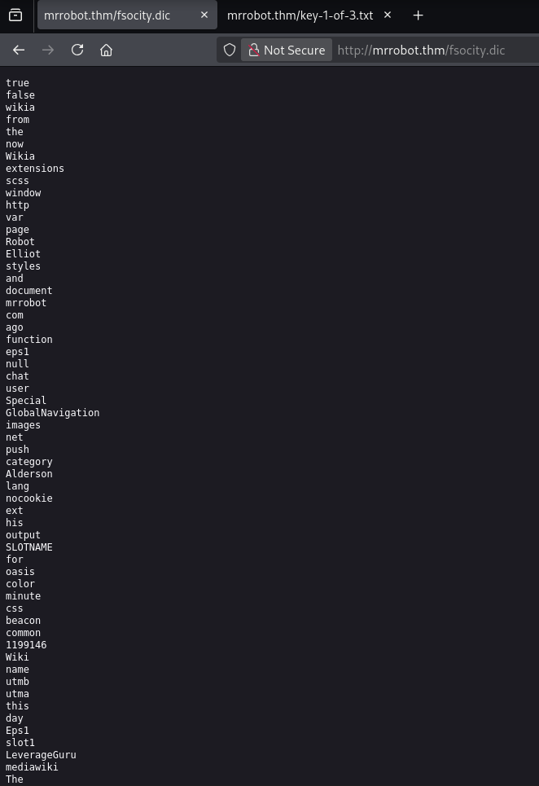  
*Figure 6 — Wordlist/dictionary discovered for future credential attempts.*

---

# Encoded content & credential discovery

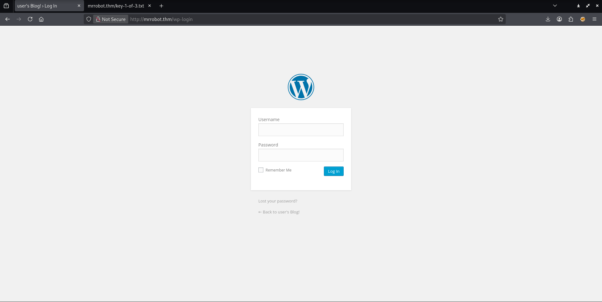  
*Figure 7 — Application login form.*

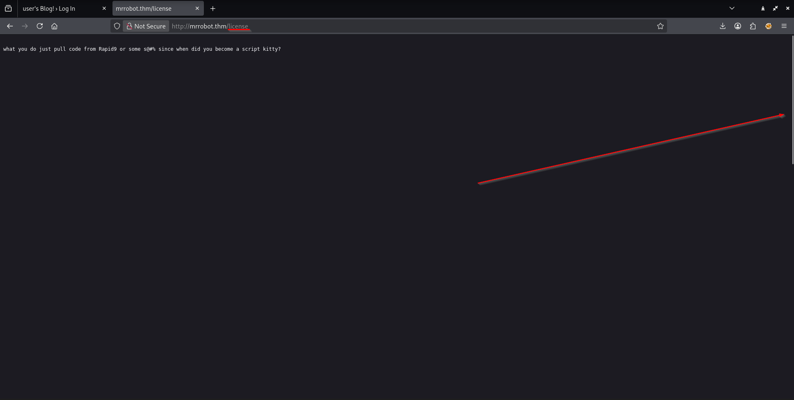  
*Figure 8 — License page containing encoded information.*

  
*Figure 9 — Extracted base64-encoded string.*

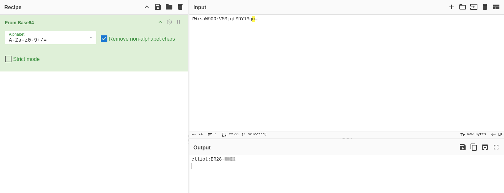  
*Figure 10 — Credentials recovered after decoding.*

**Explanation:** The recovered credentials allowed initial authenticated access.

---

# Foothold & Reverse Shell

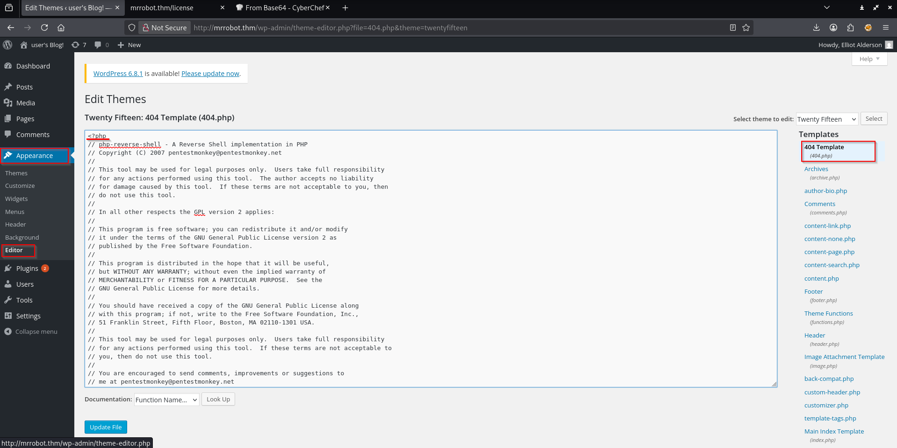  
*Figure 11 — Reverse shell payload preparation.*

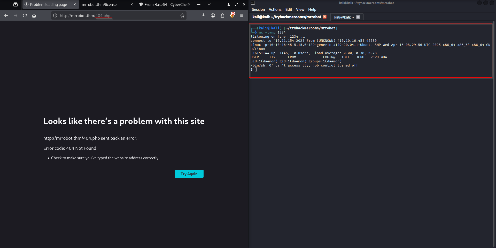  
*Figure 12 — Successful reverse shell connection.*

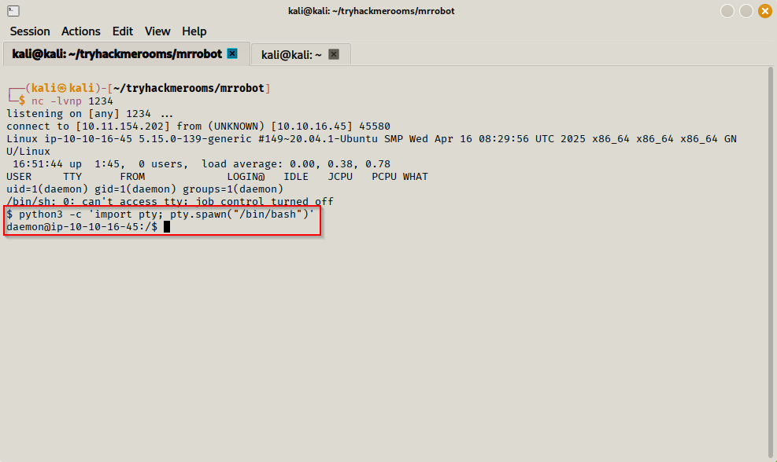  
*Figure 13 — Stabilizing the shell using Python pty.*

---

# Local enumeration & user credentials

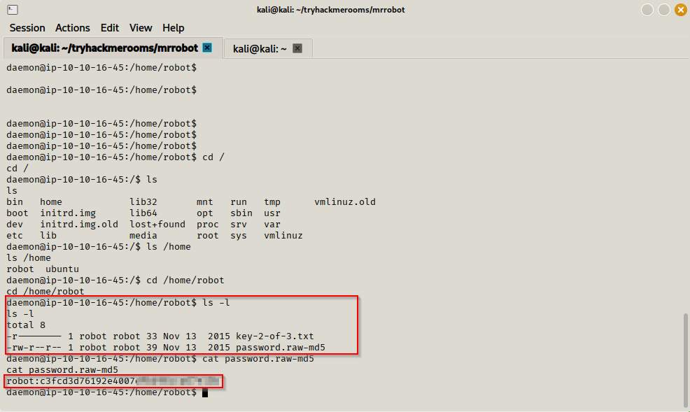  
*Figure 14 — Files containing the robot user clues.*

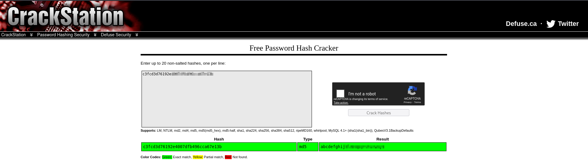  
*Figure 15 — Password discovered enabling user pivoting.*

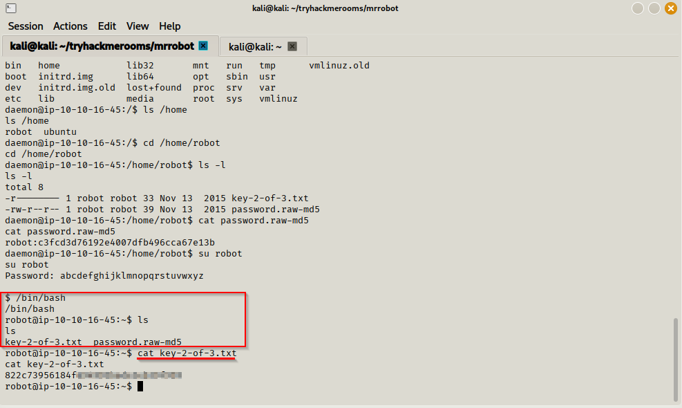  
*Figure 16 — Second key fragment found.*

---

# Privilege escalation

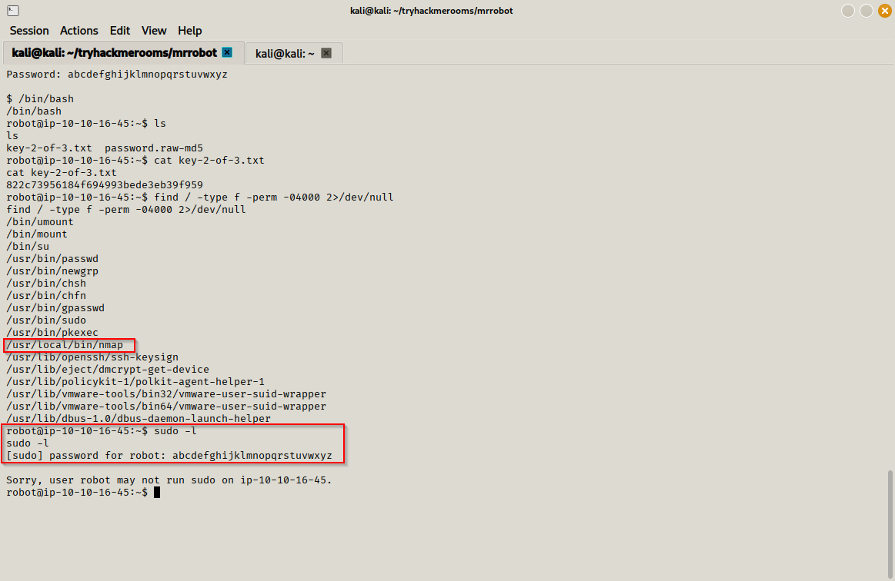  
*Figure 17 — Enumeration of escalation methods.*

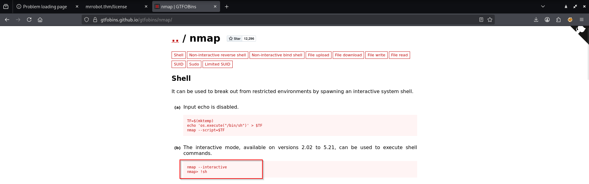  
*Figure 18 — Privilege escalation using GTFOBins technique.*

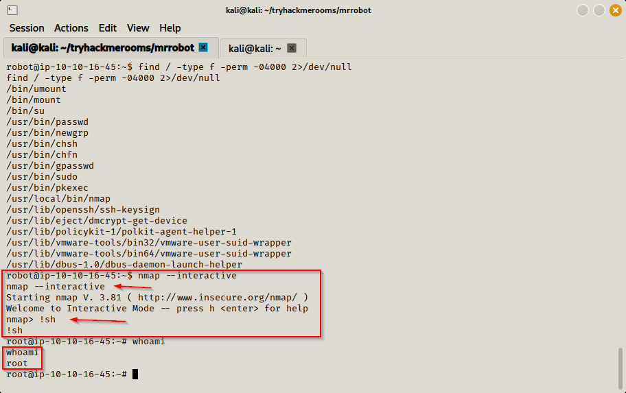  
*Figure 19 — Alternative escalation using nmap interactive shell.*

---

# Root proof & final key

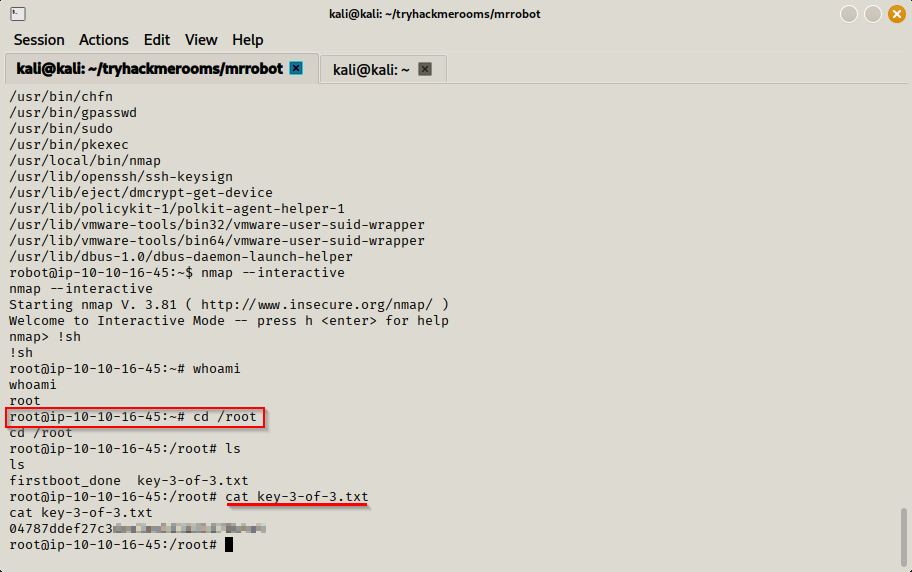  
*Figure 20 — Final key fragment / root flag.*

---

# Mitigations & recommendations

- Do not expose sensitive paths in `robots.txt`.  
- Avoid storing encoded credentials in public files.  
- Remove unnecessary SUID binaries and restrict sudo permissions.  
- Enforce strict file permissions and access controls.  
- Monitor server logs for anomalies and brute-force attempts.  

---

# Included files

- `screenshots/` — All screenshots.  
- `Walkthrough.md` — This walkthrough.

---

# Final notes
This walkthrough is intended for educational and defensive purposes only. Unauthorized access is illegal.
