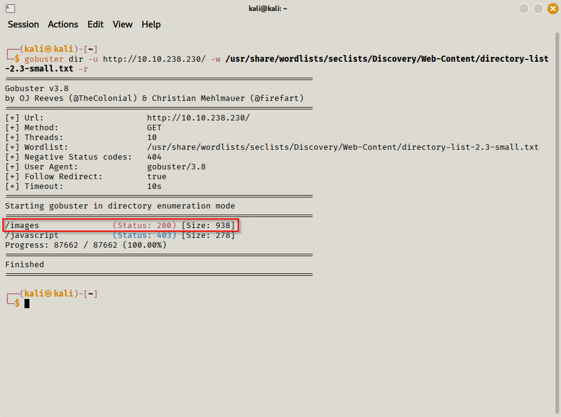
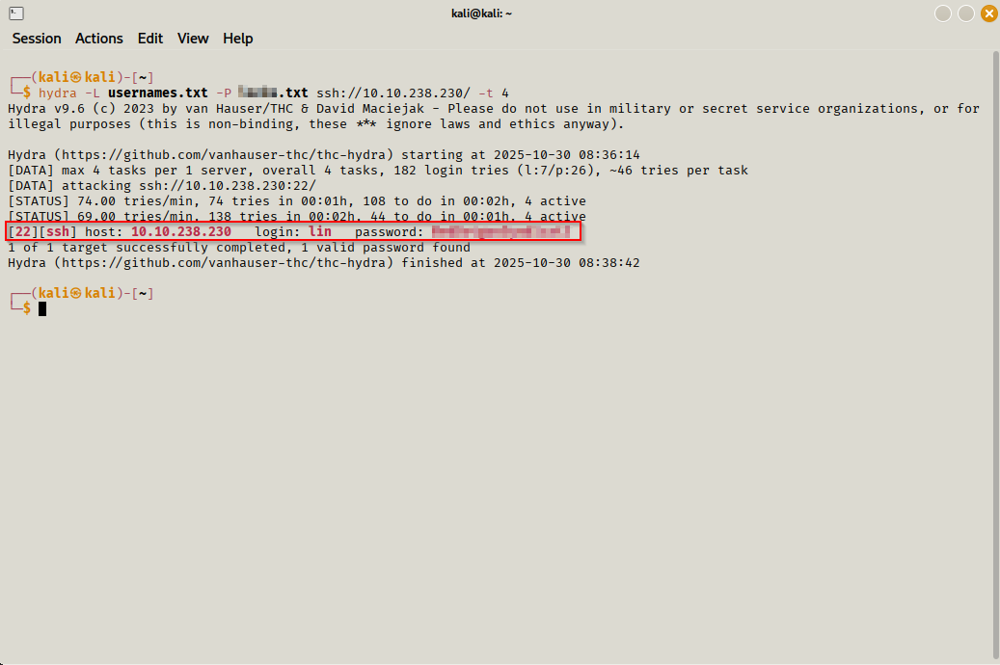
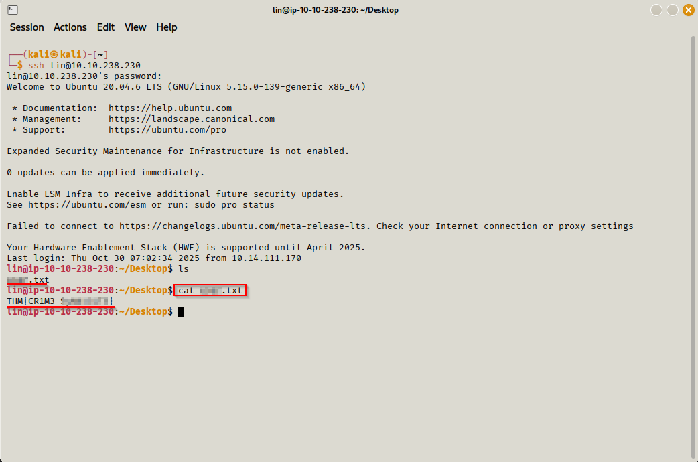
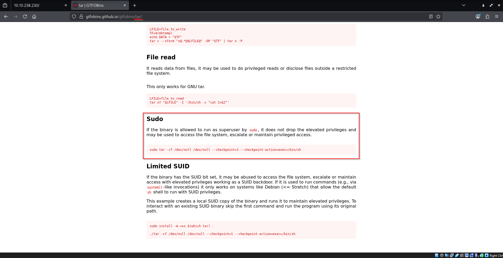
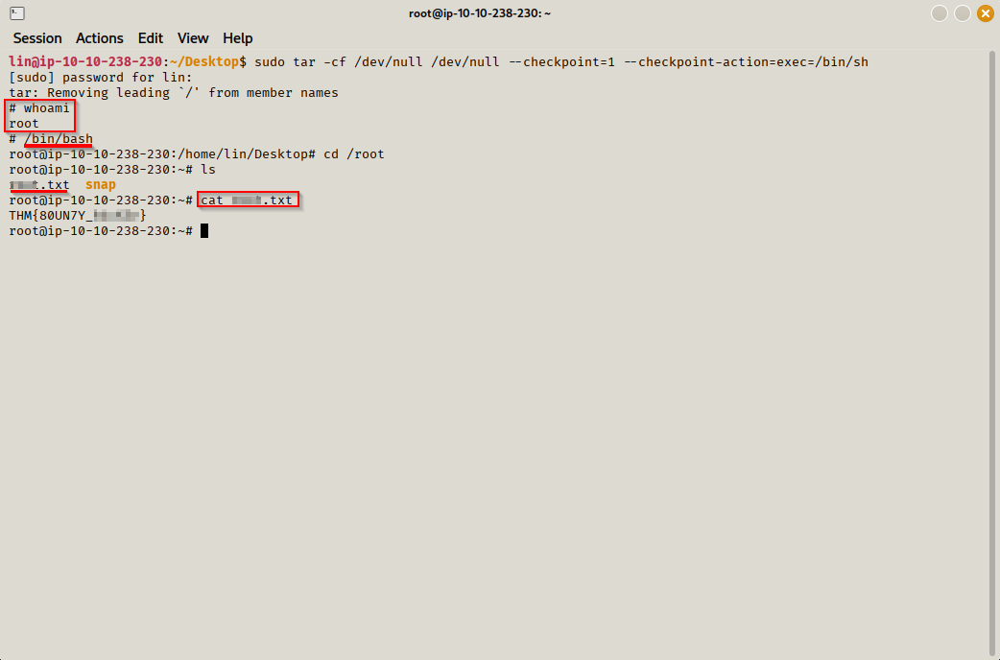

# Bounty Hacker — Walkthrough

**Author:** Tiago Dias, Bertrand Achu, Mario Brunnsteiner
**Room:** Bounty Hacker (TryHackMe)  
**Goal:** Obtain the sensitive root file.

---

## Summary
Short chain: anonymous FTP → recovered credentials file → SSH login → sudo escalation to root.

---

## How to read this walkthrough
- Screenshots are in `screenshots/`.  
- Outputs and credentials are redacted.  
- This is a learning/walkthrough document. Not an exploit repository.

---

## Recon
**What I did:** port scan and service enumeration.

  
*Figure 1 — Nmap showing open FTP, SSH and HTTP ports and vulnerability script output.*

  
*Figure 2 — Gobuster results pointing to directories and files of interest.*

**Notes:** Anonymous FTP and web content discovery guided the next steps.

---

## Web enumeration
  
*Figure 3 — Hints of possible usernames obtained from the web application.*

  
*Figure 4 — `/images` directory containing files with useful information.*

**Explanation:** Public files contained metadata and clues for credentials/users.

---

## FTP: anonymous access and file found
  
*Figure 5 — Access to FTP (anonymous).*

  
*Figure 6 — File downloaded from FTP containing credentials/partials (redacted).*

**Explanation:** The file on the FTP contained credentials which I used to proceed to SSH.

---

## User enumeration & credential use
  
*Figure 7 — Compiled list of usernames gathered during enumeration.*

  
*Figure 8 — Automated attempt with Hydra using the username list and wordlist.*

**Explanation:** I used the username list with a wordlist to validate credential reuse.

---

## User access & proof
  
*Figure 9 — Successful SSH login as the user and viewing the user flag.*

**Explanation:** Recovered credentials allowed SSH access to the target user. Local enumeration followed.

---

## Privilege escalation
  
*Figure 10 — Identifying and exploiting a vulnerability that enables privilege escalation.*

  
*Figure 11 — Use of a documented GTFOBins technique to escalate via a sudo-allowed binary.*

**Explanation:** `sudo -l` revealed a binary allowed without password. The binary's behavior allowed escalation to root using documented techniques.

---

## Root proof
  
*Figure 12 — Root flag proof (redacted).*

**Notes:** Image redacted to remove sensitive content.

---

## Mitigations and recommendations
- Disable anonymous FTP.  
- Avoid `NOPASSWD` sudo entries.  
- Enforce credential rotation and stronger authentication.  
- Monitor FTP and web access logs for suspicious downloads.  
- Regularly review binaries with elevated permissions.

---

## Included files
- `report.pdf` — Full written report.  
- `screenshots/` — All screenshots listed above.  
- `ATTACK-mapping.md` — MITRE ATT&CK mapping.  
- `recommendations.md` — Detailed mitigations.

---

## Final notes
This walkthrough is intended for learning and defensive improvement. Do not use these steps for unauthorized access.
